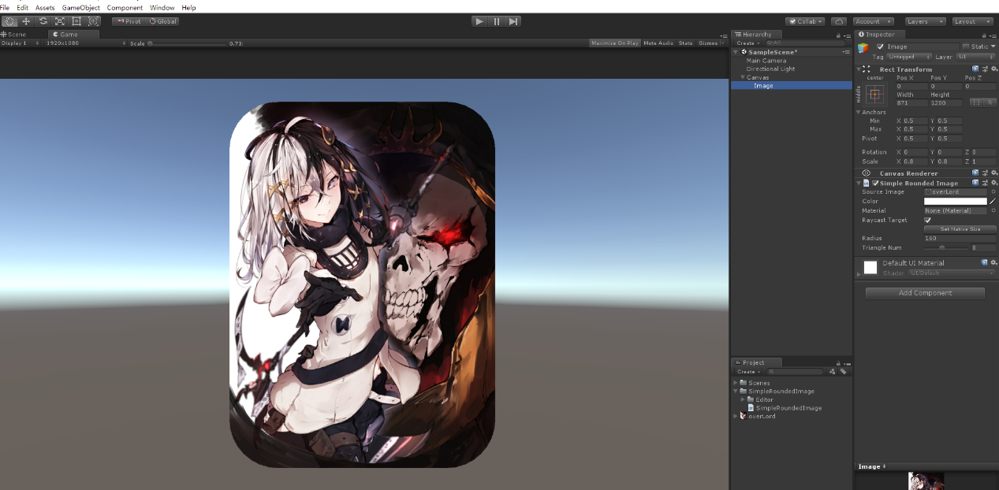
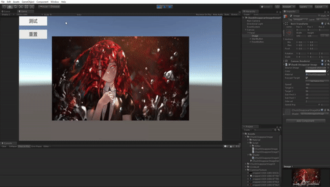

# 导航
## SimpleRoundedImage
在unity中，不使用Mask，通过修改顶点信息实现的圆角矩形图片。  
  
文档链接：[SimpleRoundedImage](Readme/SimpleRoundedImage/README.md)
## CircleList
CircleList是一个通过UGUI实现的圆形列表，通过缩放、平移和层级的改变模拟一个3D的圆形列表。  
  
文档链接：[CircleList](Readme/CircleList/README.md)
## ChunkDisappearImage
一个以矩形为单位的图片消失分解效果的实现。  
  
文档链接：[ChunkDisappearImage](Readme/ChunkDisappearImage/README.md)