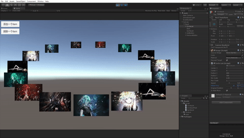
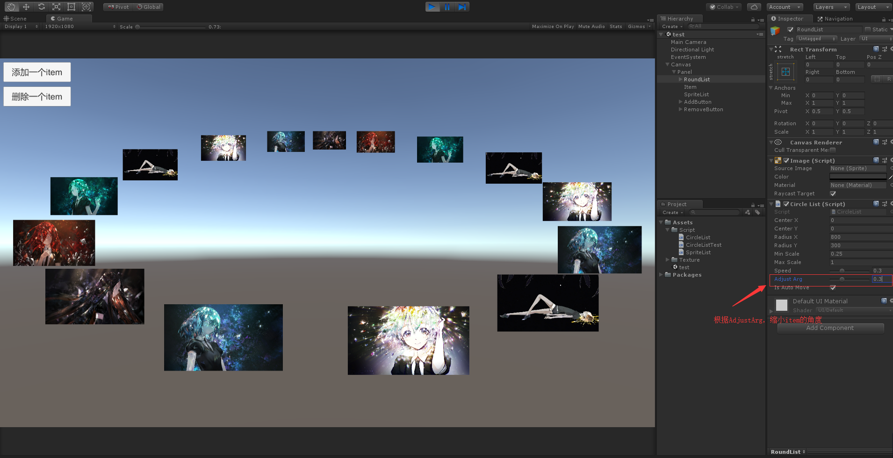

# CircleList
CircleList是一个通过UGUI实现的圆形列表，通过缩放、平移和层级的改变模拟一个3D的圆形列表。
# 效果
## 添加与旋转
 
## 间距调整
 
## 椭圆形的旋转
 
# 参数
**CenterX:** 椭圆圆心的x坐标偏移量  
**CenterY:** 椭圆圆心的y坐标偏移量  
**RadiusX:** 椭圆的长轴  
**RadiusY:** 椭圆的短轴 
**MinScale:** 缩放的最小值，缩放值在[0,π]间逐渐增大，在[π,2π]间逐渐减小  
**MaxScale:** 缩放的最大值
**Speed:** 滑动距离对旋转速度的影响参数  
**AdjustArg:** 调整间距的参数，值越小前方的item布局越松散 
**OriginalRotatin:** 椭圆的初始旋转角度  
**IsAutoMove:** 是否自动转动  
# 原理
&emsp;&emsp;以横向滑动的距离作为每个item旋转角度的增量来实现列表的转动，同时将角度控制在[0,2π]，方便进行其他的计算。 
&emsp;&emsp;在将每次拖动的距离向item旋转角做变化时做了一些处理，先算出点击点向量AB的的垂直向量BF(x2,y2)，也就是半径为AB的圆的切线。将BF标准化后得到向量B'F'(x2',y2')，让后计算GB、B'F'的点积，用结果乘上速度参数作角度的增量，实现滑动的效果。
 
&emsp;&emsp;根据item的个数，计算出每个item间的间隔，以此为依据进行布局。(总旋转角+item在队列中的位置*item间的间隔)作为每个item的最终旋转角。   
  
&emsp;&emsp;以角度的值为缩放的依据，让item在[0,π]之间逐渐增大，在[π,2π]之间逐渐减小。模拟出近大远小的感觉,同时以item的缩放来重新设置item的层级，解决item的遮挡关系（层级的排序通过一个辅助列表实现）。  
&emsp;&emsp;但是让每个item之间相隔的角度相等的话，就会显得前方的item比较拥挤，所以通过每个item的缩放值进行角度的二次调整，让列表显得不是那么拥挤。  
  
  
&emsp;&emsp;在计算出每个item的位置后，将item的位置以圆心为原点，旋转θ度，实现椭圆的旋转。

