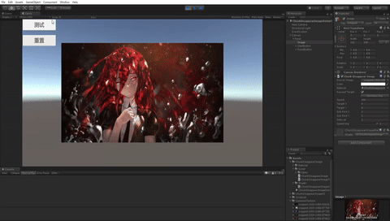
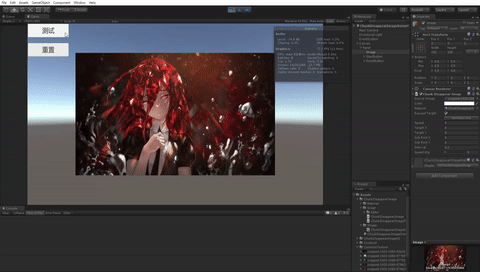
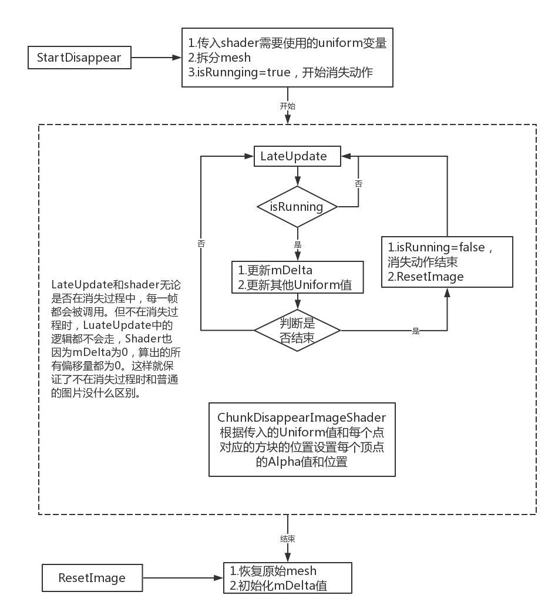
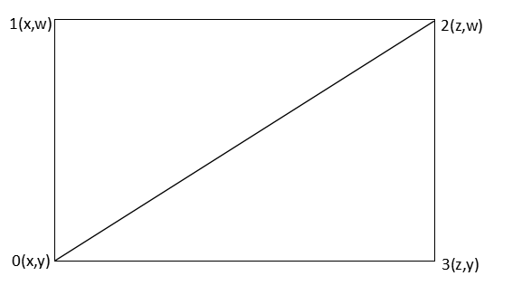
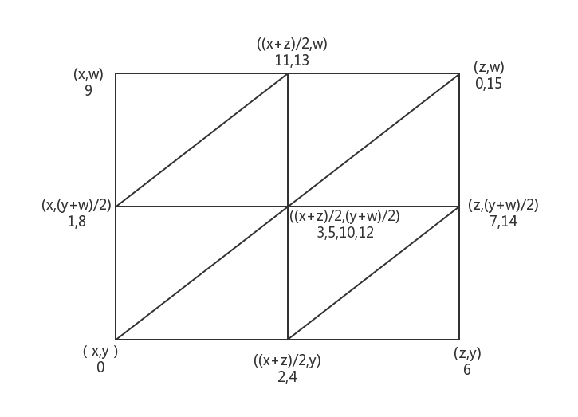
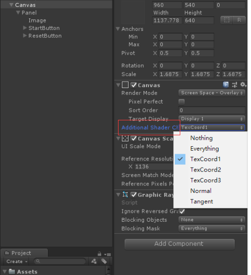
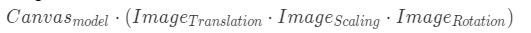
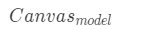
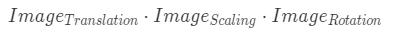
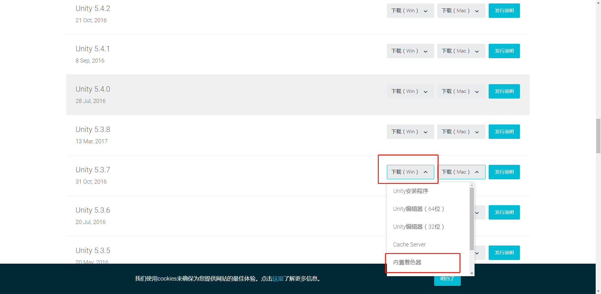

# ChunkDisappearImage
一个以矩形为单位的图片消失分解效果的实现
# 效果



# 使用
1.将ChunkDisappearImage挂在一个空GameObject上。  
2.将ChunkDisappearImage的Material设为ChunkDisappearImageMaterial。  
3.设置RectTransform的宽、高、缩放、旋转等参数。设置ChunkDisappearImage的参数。  
# 参数
**Speed：** 小方块移动的速度。  
**TargetX,TargetY：** 每个小方块移动的终点坐标。  
**SubRectX,SubRectY：** 每个小方块的长宽。  
**Interval：** 每个小方块开始移动时间的间隔。  
**SpeedArg：** 距离越远的方块是否运行越快，_SpeedArg为1时，所有方块运行速度基本相同，值越小，距离越远的方块运行的越快。  
ps：目标点的坐标，小方块的宽高都是Image对象为父节点的本地坐标。  
# 实现
## 简介
**实现主要分为三个步骤：**  
1.修改image的mesh。
2.将与运动相关的参数传入shader中。
3.在移动结束后将mesh恢复为普通的image的shader。

## 实现细节
### mesh的拆分
#### 1.Image通过OnPopulateMesh函数构建对应的mesh，所以我们通过重写Image的OnPopulateMesh来对mesh进行构建。  
**Image的默认mesh：**  
  
**拆分后的mesh：** 以拆分为四块为例  
  
将mesh拆分为很多个小矩形后，还得想办法告诉shader每个顶点是属于那个矩形的，才能以此为依据进行矩形的移动。  
#### 2.如何告诉shader每个顶点是属于哪个矩形的。
```cs
public partial struct UIVertex
{
    public Vector3 position;
    public Vector3 normal;
    public Vector4 tangent;
    public Color32 color;
    public Vector2 uv0;
    public Vector2 uv1;
    public Vector2 uv2;
    public Vector2 uv3;
```
可以看下描述一个UI顶点的结构体中都包含了哪些字段，UGUI中只用到了position，color，uv0这三个字段。  
这代表我们可以使用剩余的字段传我们需要的额外信息，这里选择使用uv1字段将每个矩形的左下角的点作为矩形的位置信息传入shader，在shader中，以此为基础进行小矩形块的移动。  
**注意：** 
①不能用normal和tangent，因为UGUI在渲染时，传入shader中的position不是传入VertexHelper时的原始值，而是该点在根canvas上的坐标，同理，normal，tangent也做了相应的变换。不是原始值了。
所以在传额外信息的时候要用uv1、uv2、uv3字段，这三个字段不会随点的移动、旋转、缩放而改变。
②由于unity高版本在ugui渲染时做了优化，在默认情况下只会将position、color、uv0三个字段传入shader，所以需要手动将uv1设为生效才行。  
  
### image本地坐标到根canvas坐标的模型矩阵的计算
```cs
mLocalToCanvas = canvas.rootCanvas.transform.localToWorldMatrix.inverse * transform.localToWorldMatrix;
```
**image的模型矩阵：**
  
**canvas的模型矩阵：**
  
由于矩阵满足结合律，所以用用canvas的模型矩阵的逆乘以image的模型矩阵会将canvas的模型矩阵消掉，也就是image坐标->canvas坐标的模型矩阵：
  
用这个矩阵乘上image上的本地坐标就可以算出对应的canvas上的坐标。 
### 开始时间和结束时间的计算
**开始时间**
分两种情况：
①当目标点在图片内时，不去算准确的起始时间，直接设置为0。  
②当目标点在图片外时，最近点一定是四个顶点之一。遍历四个顶点，计算一下离目标点最近的方块开始运动时的_Delta值，即f第一次不为0的时候  
**结束时间**
计算一下最远点的f为1的情况即可，由于距离目标点最远的点一定是四个顶点之一，所以枚举四个顶点即可。  
### shader的重写  
我们要改动Image默认的shader的顶点着色器来实现每个顶点的位移和alpha值的降低。  
我们选择5.37f1的UGUI默认shader，UI-Default.shader进行修改，这个在unity官网就可以下到。

#### 注意：
在Unity高版本打开低版本的shader时，会对一些函数做替换，如在2018.2打开5.37f1的shader时，会对如下语句进行修改。  
```glsl
// Upgrade NOTE: replaced 'mul(UNITY_MATRIX_MVP,*)' with 'UnityObjectToClipPos(*)'
```
此demo中使用的是2018.2版本的unity，所以在低版本使用时要把这句话改回去，不然会报错。
#### 顶点的移动公式：        
```glsl
//计算该方块到目标点的距离，以此为标准作为每个方块移动时间的延迟
float distance = length(target.xyz - leftBottom.xyz);
//距离越远的方块是否运行越快，_SpeedArg为1时，所有方块运行速度大致相同，值越小，距离越远的方块运行的越快
float tempDis = 1 + distance * _SpeedArg;
float f = clamp((_Delta - distance * _Interval) / tempDis, 0, 1);
```
根据f在0-1之间的变化，来控制方块在起点到终点之间的移动和alpha值的变化。
①distance * _Interval保证每个距终点距离不同方块之间的开始移动时间会有一个间隔。
②tempDis可以控制不同距离方块之间的速度比。  
# 小结
原理其实并不难，主要只有两部分：改mesh，改shader。就是一些坐标的转换、开始结束时间的控制、版本的兼容性比较麻烦。  
在把整个流程跑通一次之后，就会对流程有一个较为全面的认识，下次做2D或是3D的一些效果思路也也会更广一些。  