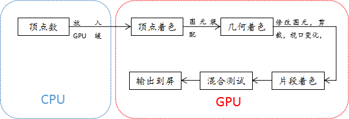
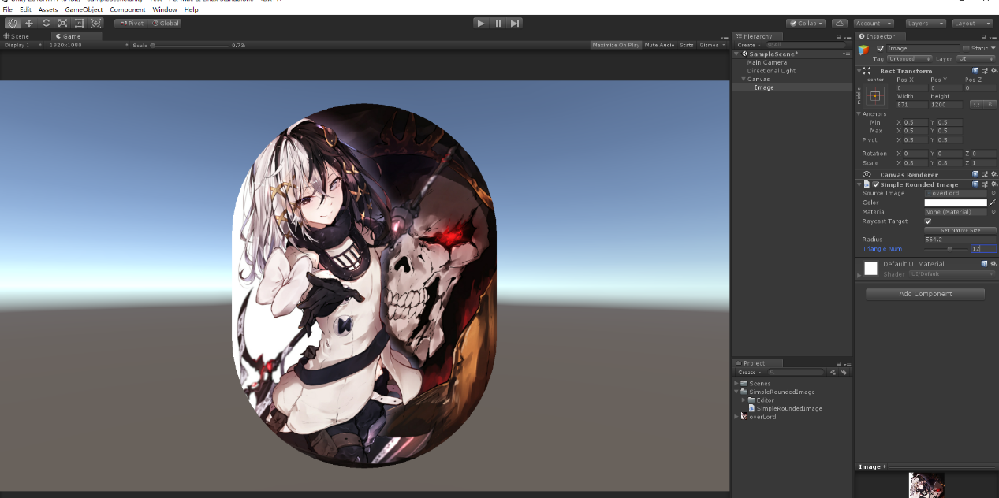
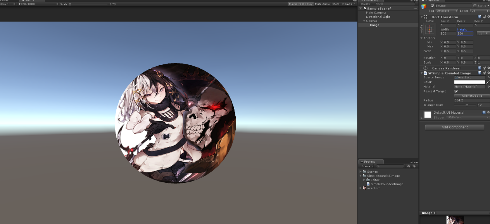

# SimpleRoundedImage

## 1.一张图片是如何显示在屏幕上的
一张图片渲染到unity界面中的大致流程。



## 2.我们要做什么
我们要做的就是在CPU中将图片的矩形顶点数据修改成圆角矩形的顶点信息，之后Unity会将修改后的顶点数据发到GPU中，并设置对应的shader，GPU就会根据我们发送的顶点数据将图片渲染成我们所要的圆角矩形图片。
## 3.怎么做
由于Unity已经帮我们做了将数据发送到GPU的工作，我们只需要在代码中去修改要传送顶点数据就可以了。  
Unity的Image组件提供了OnPopulateMesh接口。这个接口就是用来更新渲染时用的renderer mesh的顶点信息的的。我们直接重写这个函数，来修改顶点数据。

**<1>我们先来看一下一张Simple类型的图片的顶点信息是如何组织的。**

```cs
/// <summary>
/// Update the UI renderer mesh.
/// </summary>
protected override void OnPopulateMesh(VertexHelper toFill)
{   
    if (activeSprite == null)
    {
        base.OnPopulateMesh(toFill);
        return;
    }

    switch (type)
    {
        case Type.Simple:
            GenerateSimpleSprite(toFill, m_PreserveAspect);
            break;
        case Type.Sliced:
            GenerateSlicedSprite(toFill);
            break;
        case Type.Tiled:
            GenerateTiledSprite(toFill);
            break;
        case Type.Filled:
            GenerateFilledSprite(toFill, m_PreserveAspect);
            break;
    }
}
```
```cs
/// <summary>
/// Generate vertices for a simple Image.
/// </summary>
void GenerateSimpleSprite(VertexHelper vh, bool lPreserveAspect)
{
    Vector4 v = GetDrawingDimensions(lPreserveAspect);
    var uv = (activeSprite != null) ? Sprites.DataUtility.GetOuterUV(activeSprite) : Vector4.zero;

    var color32 = color;
    vh.Clear();
    vh.AddVert(new Vector3(v.x, v.y), color32, new Vector2(uv.x, uv.y));
    vh.AddVert(new Vector3(v.x, v.w), color32, new Vector2(uv.x, uv.w));
    vh.AddVert(new Vector3(v.z, v.w), color32, new Vector2(uv.z, uv.w));
    vh.AddVert(new Vector3(v.z, v.y), color32, new Vector2(uv.z, uv.y));

    vh.AddTriangle(0, 1, 2);
    vh.AddTriangle(2, 3, 0);
}
```

v是顶点坐标信息，uv是贴图坐标信息，vh是用来存储这些信息的变变量。  
每个点的位置信息（相对中轴线的位置），默认颜色，uv坐标组成了一个顶点信息放到了vh中，然后再告诉vh如何去画三角行，就可以了。
之后unity会将vh中的信息传到GPU，然后将图片展示在屏幕上。


**<2>我们如何将一张图片的顶点信息和三角形信息改成我们要的圆角矩形**

首先，我们将一张图分成6个三角形和四个90°的扇形。每个扇形用若干个三角形来模拟。这样我们就将一个圆角矩形，划分成了GPU能认识的三角形了。  
我们以扇形的半径，构成扇形的三角形的数量作为变量，就可以算出每个我们需要的顶点的坐标了。具体的实现见代码。


**实现代码：**
```cs
using UnityEngine;
using System.Collections;
using UnityEngine.UI;
using UnityEngine.Sprites;
using System.Collections.Generic;

namespace GFramework
{
    public class SimpleRoundedImage : Image
    {

        //每个角最大的三角形数，一般5-8个就有不错的圆角效果，设置Max防止不必要的性能浪费
        const int MaxTriangleNum = 20;
        const int MinTriangleNum = 1;

        public float Radius;
        //使用几个三角形去填充每个角的四分之一圆
        [Range(MinTriangleNum, MaxTriangleNum)]
        public int TriangleNum;

        protected override void OnPopulateMesh(VertexHelper vh)
        {
            Vector4 v = GetDrawingDimensions(false);
            Vector4 uv = overrideSprite != null ? DataUtility.GetOuterUV(overrideSprite) : Vector4.zero;

            var color32 = color;
            vh.Clear();
            //对radius的值做限制，必须在0-较小的边的1/2的范围内
            float radius = Radius;
            if (radius > (v.z - v.x) / 2) radius = (v.z - v.x) / 2;
            if (radius > (v.w - v.y) / 2) radius = (v.w - v.y) / 2;
            if (radius < 0) radius = 0;
            //计算出uv中对应的半径值坐标轴的半径
            float uvRadiusX = radius / (v.z - v.x);
            float uvRadiusY = radius / (v.w - v.y);

            //0，1
            vh.AddVert(new Vector3(v.x, v.w - radius), color32, new Vector2(uv.x, uv.w - uvRadiusY));
            vh.AddVert(new Vector3(v.x, v.y + radius), color32, new Vector2(uv.x, uv.y + uvRadiusY));

            //2，3，4，5
            vh.AddVert(new Vector3(v.x + radius, v.w), color32, new Vector2(uv.x + uvRadiusX, uv.w));
            vh.AddVert(new Vector3(v.x + radius, v.w - radius), color32, new Vector2(uv.x + uvRadiusX, uv.w - uvRadiusY));
            vh.AddVert(new Vector3(v.x + radius, v.y + radius), color32, new Vector2(uv.x + uvRadiusX, uv.y + uvRadiusY));
            vh.AddVert(new Vector3(v.x + radius, v.y), color32, new Vector2(uv.x + uvRadiusX, uv.y));

            //6，7，8，9
            vh.AddVert(new Vector3(v.z - radius, v.w), color32, new Vector2(uv.z - uvRadiusX, uv.w));
            vh.AddVert(new Vector3(v.z - radius, v.w - radius), color32, new Vector2(uv.z - uvRadiusX, uv.w - uvRadiusY));
            vh.AddVert(new Vector3(v.z - radius, v.y + radius), color32, new Vector2(uv.z - uvRadiusX, uv.y + uvRadiusY));
            vh.AddVert(new Vector3(v.z - radius, v.y), color32, new Vector2(uv.z - uvRadiusX, uv.y));

            //10，11
            vh.AddVert(new Vector3(v.z, v.w - radius), color32, new Vector2(uv.z, uv.w - uvRadiusY));
            vh.AddVert(new Vector3(v.z, v.y + radius), color32, new Vector2(uv.z, uv.y + uvRadiusY));

            //左边的矩形
            vh.AddTriangle(1, 0, 3);
            vh.AddTriangle(1, 3, 4);
            //中间的矩形
            vh.AddTriangle(5, 2, 6);
            vh.AddTriangle(5, 6, 9);
            //右边的矩形
            vh.AddTriangle(8, 7, 10);
            vh.AddTriangle(8, 10, 11);

            //开始构造四个角
            List<Vector2> vCenterList = new List<Vector2>();
            List<Vector2> uvCenterList = new List<Vector2>();
            List<int> vCenterVertList = new List<int>();

            //右上角的圆心
            vCenterList.Add(new Vector2(v.z - radius, v.w - radius));
            uvCenterList.Add(new Vector2(uv.z - uvRadiusX, uv.w - uvRadiusY));
            vCenterVertList.Add(7);

            //左上角的圆心
            vCenterList.Add(new Vector2(v.x + radius, v.w - radius));
            uvCenterList.Add(new Vector2(uv.x + uvRadiusX, uv.w - uvRadiusY));
            vCenterVertList.Add(3);

            //左下角的圆心
            vCenterList.Add(new Vector2(v.x + radius, v.y + radius));
            uvCenterList.Add(new Vector2(uv.x + uvRadiusX, uv.y + uvRadiusY));
            vCenterVertList.Add(4);

            //右下角的圆心
            vCenterList.Add(new Vector2(v.z - radius, v.y + radius));
            uvCenterList.Add(new Vector2(uv.z - uvRadiusX, uv.y + uvRadiusY));
            vCenterVertList.Add(8);

            //每个三角形的顶角
            float degreeDelta = (float)(Mathf.PI / 2 / TriangleNum);
            //当前的角度
            float curDegree = 0;

            for (int i = 0; i < vCenterVertList.Count; i++)
            {
                int preVertNum = vh.currentVertCount;
                for (int j = 0; j <= TriangleNum; j++)
                {
                    float cosA = Mathf.Cos(curDegree);
                    float sinA = Mathf.Sin(curDegree);
                    Vector3 vPosition = new Vector3(vCenterList[i].x + cosA * radius, vCenterList[i].y + sinA * radius);
                    Vector3 uvPosition = new Vector2(uvCenterList[i].x + cosA * uvRadiusX, uvCenterList[i].y + sinA * uvRadiusY);
                    vh.AddVert(vPosition, color32, uvPosition);
                    curDegree += degreeDelta;
                }
                curDegree -= degreeDelta;
                for (int j = 0; j <= TriangleNum - 1; j++)
                {
                    vh.AddTriangle(vCenterVertList[i], preVertNum + j + 1, preVertNum + j);
                }
            }
        }

        private Vector4 GetDrawingDimensions(bool shouldPreserveAspect)
        {
            var padding = overrideSprite == null ? Vector4.zero : DataUtility.GetPadding(overrideSprite);
            Rect r = GetPixelAdjustedRect();
            var size = overrideSprite == null ? new Vector2(r.width, r.height) : new Vector2(overrideSprite.rect.width, overrideSprite.rect.height);
            //Debug.Log(string.Format("r:{2}, size:{0}, padding:{1}", size, padding, r));

            int spriteW = Mathf.RoundToInt(size.x);
            int spriteH = Mathf.RoundToInt(size.y);

            if (shouldPreserveAspect && size.sqrMagnitude > 0.0f)
            {
                var spriteRatio = size.x / size.y;
                var rectRatio = r.width / r.height;

                if (spriteRatio > rectRatio)
                {
                    var oldHeight = r.height;
                    r.height = r.width * (1.0f / spriteRatio);
                    r.y += (oldHeight - r.height) * rectTransform.pivot.y;
                }
                else
                {
                    var oldWidth = r.width;
                    r.width = r.height * spriteRatio;
                    r.x += (oldWidth - r.width) * rectTransform.pivot.x;
                }
            }

            var v = new Vector4(
                    padding.x / spriteW,
                    padding.y / spriteH,
                    (spriteW - padding.z) / spriteW,
                    (spriteH - padding.w) / spriteH);

            v = new Vector4(
                    r.x + r.width * v.x,
                    r.y + r.height * v.y,
                    r.x + r.width * v.z,
                    r.y + r.height * v.w
                    );

            return v;
        }
    }
}

```

**Editor代码：**

```cs
using System.Linq;
using UnityEngine;
using UnityEditor.AnimatedValues;
using UnityEngine.UI;
using UnityEditor;
using UnityEditor.UI;

namespace GFramework
{
    [CustomEditor(typeof(SimpleRoundedImage), true)]
    //[CanEditMultipleObjects]
    public class SimpleRoundedImageEditor : ImageEditor
    {

        SerializedProperty m_Radius;
        SerializedProperty m_TriangleNum;
        SerializedProperty m_Sprite;


        protected override void OnEnable()
        {
            base.OnEnable();

            m_Sprite = serializedObject.FindProperty("m_Sprite");
            m_Radius = serializedObject.FindProperty("Radius");
            m_TriangleNum = serializedObject.FindProperty("TriangleNum");

        }
        public override void OnInspectorGUI()
        {
            serializedObject.Update();

            SpriteGUI();
            AppearanceControlsGUI();
            RaycastControlsGUI();
            bool showNativeSize = m_Sprite.objectReferenceValue != null;
            m_ShowNativeSize.target = showNativeSize;
            NativeSizeButtonGUI();
            EditorGUILayout.PropertyField(m_Radius);
            EditorGUILayout.PropertyField(m_TriangleNum);
            this.serializedObject.ApplyModifiedProperties();
        }
    }
}

```

**需要注意的点：**

①UV坐标是[0-1]的，不随image的宽和高变换的，所以在做uv映射的时候要将uv坐标做等比例的处理，不然会出现断层的情况。  
②在计算顶点信息的时候，要注意Pivot对顶点坐标的影响（直接照搬Image的处理就可以了）  
③注意没有贴图的时候的处理，要让这张图片显示默认颜色。  
```cs
Vector4 uv = overrideSprite != null ? DataUtility.GetOuterUV(overrideSprite) : Vector4.zero;
```
④因为直接继承Image类的类在Inspector面板上不会显示新定义的public变量，所以我们还要写一个SimpleRoundedImageEditor.cs来将新定义的圆角矩形半径和构成一个90°扇形的三角型的展示在面板上，顺便隐藏一下图片的类型，因为只实现了simple类型图片的圆角矩形。

## 4.效果





## 5.关于效率

 |           | Mask          | SimpleRoundedImage
------------ | ------------- | ------------
DrawCall     | 3             | 1
顶点数        | 4            | 30个左右（一般每个扇形由6个三角型组成就可以达到较好的效果），顶点数量可以接受。

**总结**：如果在相同mask且之间没有相互遮挡的情况下，unity会对drawCall进行动态批处理，所以Mask数量的增加对drawCall的影响很小，只有在有多个不同mask或mask相互遮挡的情况下，每个mask会额外增加2次DrawCall。对DrawCall数量有较大的影响，但这种情况较少。    
所以SimpleRoundedImage在大多数情况下对效率的提升并不明显。但通过修改顶点的方式实现圆角的方式会比使用遮罩实现圆角更加灵活方便。